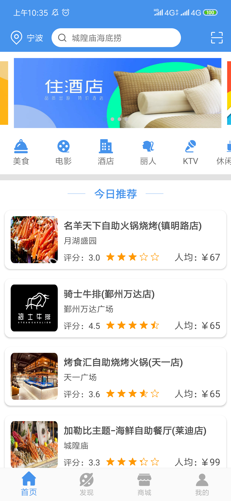

# ThriftTogether

基于 Android 平台的团购 APP Demo，部分功能待实现，图片仅为样例，有些功能可能不存在。
[后台代码](https://github.com/hncboy/ThriftTogetherBackstage) 

# 1.软件概述
## 1.1概述
团节是一个团购平台，团购（Group purchase）就是团体购物，指认识或不认识的消费者联合起来，加大与商家的谈判能力，以求得最优价格的一种购物方式。团节通过与商家的合作，根据薄利多销的原理，商家可以给出低于零售价格的团购折扣和单独购买得不到的优质服务。团节实现团购商品的查看、选购、支付的一站式团购平台，以低廉的价格让用户可以在家完成购物过程。
## 1.2 功能
（1）用户登录：用户进入登录界面，输入用户名（手机号）、密码验证身份，进入首页。

（2）用户注册：用户阅读并同意相关协议后，通过手机号码进行注册并设置初始密码。

（3）忘记密码：用户忘记登录密码时，可凭短信验证找回密码。

（4）密码修改：用户可进入个人中心进行登录密码的修改。

（5）意见反馈：用户可对软件各个方面进行意见反馈并提交

（6）主菜单：显示首页、发现、商城、我的等子菜单图标，首页提供各个类别商家入口等。

（7）商品分类：按照美食、电影、酒店、KTV、丽人、休闲娱乐等将商品和店铺进行分类展示。

（8）今日推荐：推荐店铺集中展示，每天更新。

（9）猜你喜欢：根据用户历史搜索数据进行统计和预测，筛选用户经常浏览或消费的商品和商家。

（10）预定：用户选择商品进行预定，商家收到预定消息并进行预定管理。
（11）支付：用户对消费的商品进行安全支付。

（12）二维码扫描：商家通过扫描用户订单的二维码实现订单的使用。

（13）积分商城：用户可以用评价订单获得积分兑换商城中的优惠券。

（14）发现：通过定位功能查询附件的商家并可以进行地图展示和列表展示。
## 1.3 性能
软件具有良好的易用性和可靠性，并保证信息的安全性和保密性。

# 2. 运行环境
安卓开发环境可在Android 3.4.1上运行。

后台开发环境可在IntelliJ IDEA 2019.1.2 (Ultimate Edition)上运行。

APP端可在Android7版本以上的手机运行

# 3. 使用方法
## 3.1 软件安装
自己运行项目
## 3.2 软件运行
用户在安装完毕后，点击桌面图标即可进入系统，界面如图：

  
    
    

 图 3-1 首页界面 
 

## 3.3 用户注册

## 3.4 用户登录

## 3.5 首页

### 3.5.1 切换城市

### 3.5.2 搜索店铺

### 3.5.3 扫描二维码

### 3.5.4 今日推荐

### 3.5.5 猜你喜欢

### 3.5.6 美食

### 3.5.7 电影

### 3.5.8 酒店

### 3.5.9 丽人

### 3.5.10 KTV

### 3.5.11 休闲娱乐

## 3.6 发现

### 3.6.1 周边

### 3.6.2 导航

## 3.7 商城

## 3.8 店铺

### 3.8.1 店铺详情

### 3.8.2 店铺评论

### 3.8.3 预约店铺

### 3.8.4 团购详情

### 3.8.5 确认订单

## 3.9 我的

### 3.9.1 我的

### 3.9.2 我的详情

### 3.9.3 我的收藏

### 3.9.4 我的卷包

### 3.9.5 活动通知

### 3.9.6 意见反馈

### 3.9.7 通用设置

### 3.9.8 个人信息

## 3.10 订单

### 3.10.1 全部订单

### 3.10.2 待付款

### 3.10.3 待使用

### 3.10.4 待评价

### 3.10.5 退款/售后
